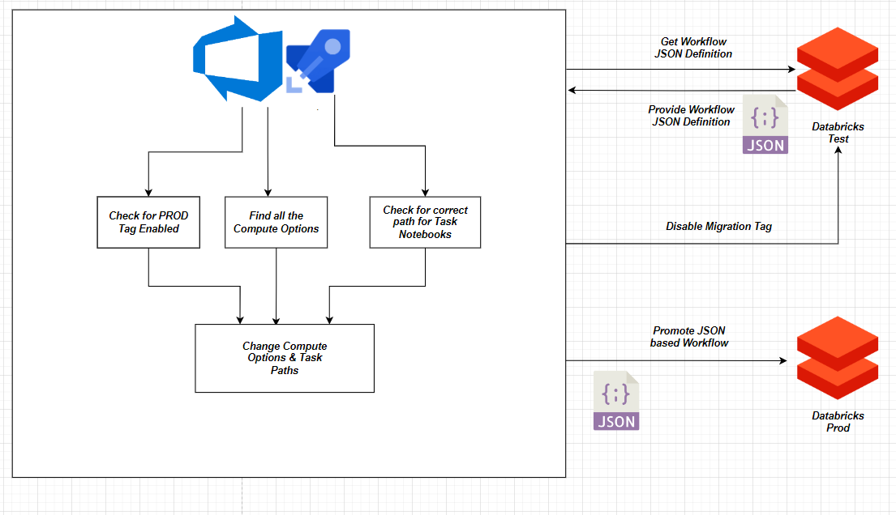

# Databricks Workflows Migration Across Workspaces Using Azure Pipelines

# Introduction
Databricks does not offer any functionality to migrate workflows/jobs from one workspace to another. This CI pipeline developed allows migration of workflows across different workspaces of Databricks. This pipeline does not create any compute resources and assumes that compute resources like pools and clusters either exist in the higher environment with the same names or if that is not the case then this pipeline assumes that mappings for the compute switching are provided as variables in the pipeline. This pipeline can be scheduled for a daily run in order to make sure that both the environments/workspaces are in sync when it comes to workflows

# Design and Implementation
The solution proposed migrates workflows from one Databricks workspace(test) to another(prod) through the following steps:

1.  Initiate a yml based azure pipeline with ubuntu image installed on top of the agent that is running the pipeline in order to run the bash script in the pipeline environment

2. Download the Databricks CLI 
    
3.  Configure the Databricks CLI using the test workspace authentication token
    
4.  Filter those workflows which are ready for migration(whose PROD_MIGRATION tag has been set to true)
    
5.  Get the JSON definition for production ready workflows
    
6.  Get the compute resources(clusters,pools) for the production ready workflows
    
7.  Ensure that all the tasks within a particular workflow have notebooks which point towards the development folder
    
8.  Persist the JSON definitions and compute resources names in the agent environment
    
9.  Set the PROD_MIGRATION flag to False for all the production ready workflows in the test environment
    
10.  Configure the Databricks CLI using the prod workspace authentication token
    
11.  Get hold of all the JSON documents persisted in the agent and for each one of the tasks in each one of the workflows, point all the notebook paths to the production folder
    
12.  For each of the JSON documents, map the development compute resources to their corresponding counterparts in production
    
13.  Create jobs/workflows using all these updated JSON documents

The architecture diagram below explain the entire process in more detail:

  

